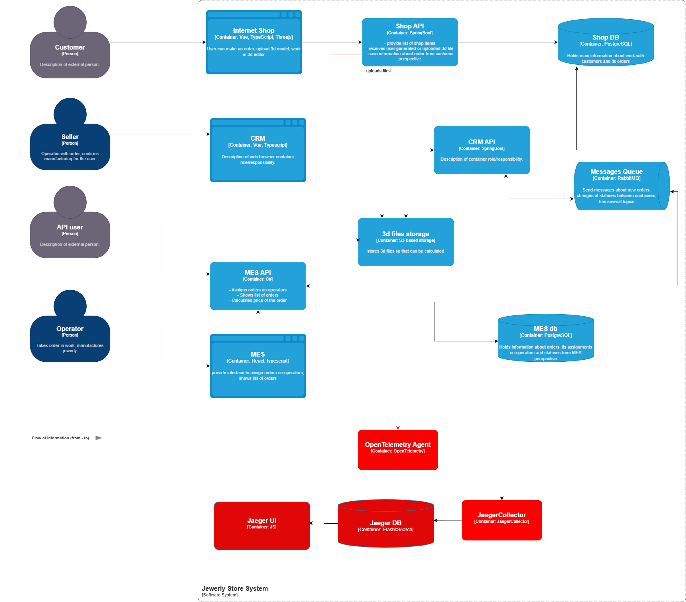
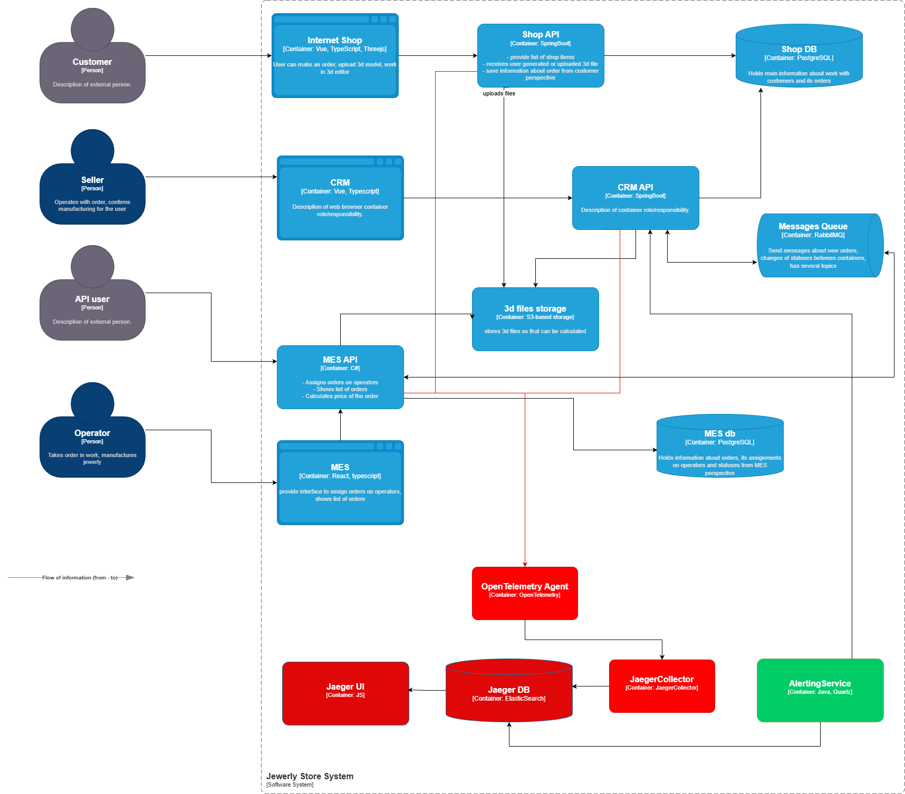
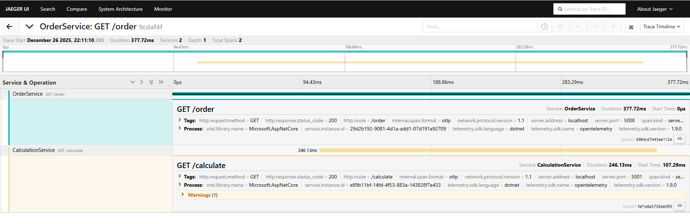

# Архитектурное решение по трейсингу

## Мотивация

В текущей архитектуре «Александрита» отсутствует сквозная наблюдаемость жизненного цикла заказа. Заказ проходит через несколько систем (онлайн-магазин, CRM, MES, RabbitMQ), при этом:

* нет единого идентификатора, по которому можно отследить заказ end-to-end;
* невозможно быстро понять, где именно заказ «завис»;
* потеря сообщений в очередях выявляется постфактум, через жалобы клиентов;
* поддержка и бизнес оперируют симптомами, а не причинами.

Внедрение трэйсинга позволит:

* видеть полную цепочку обработки заказа от создания до закрытия;
* локализовать сбои интеграции и деградации сервисов;
* сократить время восстановления системы и нагрузку на поддержку;
* повысить доверие B2B-партнёров за счёт прозрачности API.

### Метрики, на которые повлияет трейсинг

**Технические:**

* Время обработки инцидентов с заказами;
* процент «потерянных» заказов;
* среднее время прохождения заказа между статусами;

**Бизнес:**

* доля заказов, выполненных в SLA;
* количество жалоб по статусу заказа;
* удержание  клиентов.

---

## Анализ системы и точки риска

Трейсингом должны быть покрыты все компоненты, через которые проходит заказ:

1. Онлайн-магазин (Shop API) — создание и отправка заказа.
2. MES API — расчёт стоимости, производство, упаковка, отгрузка.
3. CRM API — подтверждение и закрытие заказа.
4. RabbitMQ — асинхронные переходы между системами.

### Основные точки, где заказ может «сломаться»

* публикация/чтение сообщений из RabbitMQ;
* длительный расчёт стоимости в MES;
* ручные действия операторов (взятие заказа в работу);
* сетевые и API-ошибки между сервисами;
* дублирование или потеря сообщений.

---

## Данные, попадающие в трейсинг

Каждый trace должен содержать:

* trace_id — сквозной идентификатор;
* order_id — бизнес-идентификатор заказа;
* source_system — Shop / CRM / MES;
* operation — имя бизнес-операции (calculate_price, approve_order и т.д.);
* duration;
* user_role (client / operator / api_partner);
* error - текст ошибки, если есть;

---

## Предлагаемое решение

## Компоненты

* OpenTelemetry - Собирает данные для Jaeger
* Jaeger - open-source решение позволяющее собирать и отображать собранные данные трассировки
* Elasticsearch - БД хранения данных трассировки

## Компромиссы и ограничения

* Высокая детализация увеличивает объём данных - увеличивает длительность запросов, а также стоимость хранения.
* Старые заказы без trace_id восстановить невозможно.
* Инструментирование проприетарных или легаси-компонентов может быть дорогостоящим (сначала думал что это CRM, но вроде описан стек и в команде есть соотв. специалисты).

---

## Безопасность

* Доступ к Jaeger UI только через VPN.
* Аутентификация по корпоративным учётным записям.
* Ролевая модель (support / admin / read-only).
* Исключение персональных данных из того что попадает в Elastic.

##  Предлагаемое решение (дополнительное задание)

Автоматический мониторинг и алертинг

Так как Jaeger поддерживает обращение к нему по АПИ, можно разработать новый сервис, и настроить на нем расписание тнрэкинга заказов (статусы, время на этапах).

### Алерты

* Заказ отправлен на расчет но MES не работает с ним > 5 минут => alert "Заказ застрял в очереди"
* Заказ не рассчитался за 30 минут => alert "Долгий расчет заказа"
* Заказ рассчитался, сообщение об этом ушло в брокер, но статус заказа в системе CRM не поменялся => alert "Потерянный зака.

Алерты в первую очередь нужны менеджерам в  CRM. По необходимости алерты могут поступать в группы корп. чатов, создаваться тикетом в Jira.

## Задание 3.1. Трейсинг с OpenTelemetry и Jaeger.

Сервисы добавлены в папку ./architecture-alexandrite-k8s-trace/services

Результат выполнения

