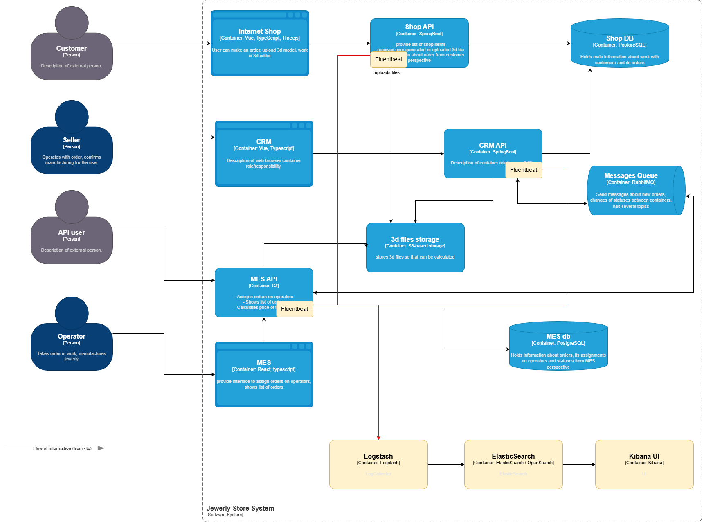

### Архитектурное решение по логированию

# Task 4. Архитектурное решение по логированию

## Какие логи необходимо собирать

| Параметр | Назначение |
| ------------- | ------------- |
| system | ShopAPI, CRM API или MES API |
| order_id | идентификатор заказа |
| user_id  | идентификатор пользователя в системе (в БД) не несущий персональных сведений |
| message | содержимое сообщения |
| log_level | уровень сообщения (INFO, WARN, ERROR ... ) |
| timestamp | метка времени (обычно добавляется автоматически) |
|||

### Что логируем:

Системы:

- ShopAPI
- CRM API
- MES API

#### Уровень `INFO` используем для основных процессов:

Работы с заказом:

- Создание заказа.
- Загрузка 3d-модели.
- Подтверждение заказа клиентом.
- Начало процесса расчета стоимости производства изделия.
- **Успешное** окончание процесса расчета стоимости производства изделия
- Оператор взял заказ, оператор завершил и отдал заказ.

#### Уровень `WARN` для уведомлений о необычном поведении системы:

- Не удачный переход по статусу заказа с повторной попыткой позже (процесс не остановлен, но чтото пошло не так).
- Проблема с отправками сообщений, но будет осуществлена попытка позже

#### Уровень `ERROR` используем для логирования процессов, завершившихся с ошибкой:

- Ошибка в процессе расчета/обработки заказа
- Любые ситуации неконсистентности данных: не найден польз-ль, не найден сотрудник для назначения (нет активных), не найден заказ, ошибочный статус, ошибка входных данных в интеграциях
- Ошибки работы с ресурсами (запрос на чтение/запись в БД, чтение/запись в брокер и прочие)

#### Уровень `DEBUG`

Используем в DEV-окружени для отладки. На прод окружении уровень будет избыточным.

#### Уровень `TRACE`

Тоже что DEBUG, но возможно при поиске отдельных ошибок. Иногда есть test и dev окружения, 1е при тестировании, 2- для подключения разработчиками с локальных машин и поиска проблем.

## Мотивация

Без надежной системы логирования расследование инцидентов возможно только со слов польз-я, либо локальной отладкой уже после проишествия инцидента.

Системное централизованное логирование даёт:

- быструю локализацию инцидентов
- снижение времени на диагностику причин,
- возможность автоматизации (alerting, детекция аномалий, кореляция с трейсингом)
- аудит и соответствие (хранение действий операторов и изменений статусов).

Ключевые метрики, которые улучшатся:

- Mean time to resolution (MTTR) — время от **ОБНАРУЖЕНИЯ** до **ИСПРАВЛЕНИЯ** проблемы.
- % инцидентов, идентифицированных по логам без вмешательства клиента.
- Частота возникновения ошибок - в ед. времени/на пользователя.
- Количество SLA-нарушений — уменьшится при адекватной диагностике и реакциях.

## Предлагаемое решение

### Выбор технологий
Используем хорошо зарекомендовавший себя Elastic Stack (Fluentbit → Logstash → Elasticsearch).

- `Fluentbit` - агент для сбора логов из сервисов и отправки их в Logstash.
- `Logstash` — инструмент для обработки логов. Отвечает за сбор, парсинг, фильтрацию и обогащение логов перед их отправкой в Elasticsearch.
- `Elasticsearch` — распределённая поисковая и аналитическая система на базе Apache Lucene. Хранит лог-события в индексах, поддерживает полнотекстовый поиск и агрегации, масштабируется горизонтально.

а также `Kibana` для для визуализации данных в `Elasticsearch`. Позволяет строить дашборды, выполнять запросы, исследовать логи в реальном времени.

Этот стек технологий используется во многих системах.

В качестве другого варианта можно предложить OpenSearch - это форк Elasticsearch и Kibana от AWS.
Поскольку OpenSearch основан на Elasticsearch версии 7.10, основные его функции и возможности будут идентичны.
Различия в лицензировании и возможности внесения изменений в код, а также ряд специфичных различий, которые необходимо тщательно исследовать перед тем, как принимать решение о том, какую технологию для логирования использовать в проекте.

Основные отличия OpenSearch от ELK:

- Открытая лицензия Apache 2.0 (OpenSearch бесплатный, в бесплатной версии ELK функциональность ограничена)
- Контроль над системой — OpenSearch позволяет вносить изменения в код и адаптировать систему под потребности клиента
- Функции безопасности остались бесплатными
- Активное сообщество — под эгидой Linux Foundation движок будет активно развиваться, а также поддерживаться в актуальном состоянии со стороны сообщества.

### Архитектура сбора логов

- Агент Fluentbit на всех подах сервисов отправляют данные в Logstash
- Logstash собирает данные, обрабатывает по созданным правилам, обогащает, отправляет в Elasticsearch
- Elasticsearch хранит логи
- Kibana Dashboards используются для поиска, отображения и дашбордов
- На каждый контур (dev, release и prod) предполагается создавать свой индекс - это упростит работу с логами
- Время хранения не прод сред достаточно ограничить неделей (размером спринта максимум), для прод среды достаточно 3х месяцев на случай возникновения проблем и отслеживания её в динамике.

### Политика безопасности

Логи должны исключать:

- пароли, хэши паролей;
- API-ключи, JWT, OAuth tokens;
- cookies;
- private keys, certificates;
- данные платёжных карт;
- персональные данные (email, phone, паспорт и т.п.), если нет явного разрешения.
- Шифрование TLS для передачи данных между Fluentbit → Logstash → Elasticsearch
- Разработчики должны иметь доступ к просмотру логов, администраторы для управление политиками и настройки индексов

## Алертинги для логов.

Примеры алертов:
- ошибки для пользователей в минуту/секунду > X
- число однотипных событий выросло до Х тысяч/ Хсек (например 3000 в сек, и мы точно уверены что такого не может быть при обычной работе)
- p95 задержка > SLA (например 5s) для выбранных API
- любая задержка выше 15сек - повод к анализу

## Критерии для выбора технологии для работы с логами

| Критерий                                | ELK (Elastic Stack)                                                            | OpenSearch                                                    | Grafana Loki                                                           | Splunk                                                                         |
|-----------------------------------------|--------------------------------------------------------------------------------|---------------------------------------------------------------|------------------------------------------------------------------------|--------------------------------------------------------------------------------|
| **Лицензия и стоимость**                | Elastic License, частично проприетарная; высокая стоимость в облаке            | Полностью OSS (Apache 2.0); бесплатный и открытый             | Полностью OSS (AGPL + Grafana Labs libs); дешёвый в эксплуатации       | Проприетарная модель; одна из самых дорогих SIEM/лог-платформ                  |
| **Масштабируемость / throughput**       | Высокая, но жрёт ресурсы; требует мощных машин для индексации                  | Аналогично ELK, но более лёгкий и дешевле в эксплуатации      | Очень высокая; оптимизирован под объектное хранение и дешёвые диски    | Очень высокая; enterprise-grade, выдерживает огромный поток при больших костах |
| **Query / latency**                     | Быстрый поиск благодаря inverted index; может деградировать при росте shard'ов | Быстрая поисковая движка; лучше поведение при больших объёмах | Поиск медленнее (лог-кьюри по chunk), но дешёвый и масштабируемый      | Лучшие показатели по скорости поиска; оптимизирован для корпораций             |
| **Интеграция с трейсингом и метриками** | Есть APM, но часть функционала платная; интеграция хорошая                     | Поддерживает trace_id, если использовать OpenTelemetry        | Отличная интеграция с Tempo и Prometheus (нативный observability-стек) | Хорошая, но завязана на коммерческие Splunk APM/Observability продукты         |
| **Эксплуатационная сложность**          | Сложный в админке: оптимизация shard, heap, JVM; требует опыт                  | Чуть проще чем ELK; меньше «магии», нет закрытых функций      | Очень простой в эксплуатации; лёгкий, без JVM, дешёвое хранение        | Очень сложная enterprise-экосистема; требует обученных специалистов            |