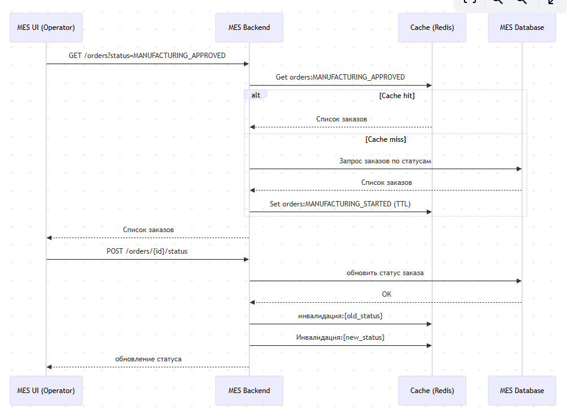

# Архитектурное решение: кеширование в MES

## Анализ текущей архитектуры

MES в системе «Александрит» выполняет критически важную роль:

* отображает операторам список заказов в работе.
* отправляет/принимает данные от CRM.
* обрабатывает смену статусов заказов
* участвует в расчёте стоимости изделий
* обслуживает поток заказов, через API и от сайта.

При линейном росте количества заказов система MES стала "узким" местом, возникли следующие проблемы:

* главная страница MES (дашборд заказов) загружается медленно;
* операторы не видят новые заказы оперативно;
* клиенты недовольны сроками выполнения заказов.

Анализ показал, что основная нагрузка приходится на **операции чтения заказов**, которые выполняются значительно чаще, чем операции записи.

## Мотивация

Кеширование предлагается внедрить как целенаправленную архитектурную меру для решения следующих проблем:

1. **Снижение нагрузки на основную БД MES**

   * Дашборд операторов постоянно выполняет тяжёлые запросы (фильтрация по статусам, сортировка по времени, пагинация).   

2. **Уменьшение времени отклика UI MES**

   * Операторам критично видеть новые заказы практически в реальном времени.
   * Даже оптимизированные SQL-запросы не смогут работать оперативно при текущем объёме данных.

3. **Повышение устойчивости при росте нагрузки**

   * Кеш позволяет сгладить пики нагрузки при наплыве заказов (особенно после открытия API).

**Что именно имеет смысл кешировать**

Наибольший эффект даст кеширование самых частных запросов:

* Списков заказов для дашборда MES.
* Вспомогательные данные для рассчета заказов (цены, тех. данные). Крометого возможно некоторые рассчеты могут быть запрошены повторно.

## Предлагаемое решение

### Тип кеширования

**Серверное кеширование**.

#### Почему не клиентское кеширование

Клиентское кеширование (браузер, cookie):

* не подходит для многопользовательского сценария;
* не гарантирует актуальность данных;
* не решает проблему нагрузки на backend и БД.

Серверное кеширование позволяет:

* централизованно управлять консистентностью;
* разгрузить БД;
* обеспечить одинаковое представление данных для всех операторов.

### Выбранный паттерн кеширования

**Cache-Aside (Lazy Loading)**.

#### Описание

* Backend MES сначала проверяет наличие данных в кеше.
* При попадании (cache hit) данные возвращаются из кеша.
* При промахе (cache miss) данные загружаются из БД и помещаются в кеш.
* При изменении статуса заказа соответствующие записи в кеше инвалидируются.

#### Почему Cache-Aside

* Прост в реализации и понимании командой.
* Не требует изменения write-path.
* Хорошо подходит для read-heavy сценариев.
* Даёт полный контроль над инвалидацией.

#### Почему не Write-Through

* Увеличивает латентность операций записи.
* MES и так испытывает нагрузку на write-path.
* Усложняет транзакционную модель.

#### Почему не Refresh-Ahead

* Требует предсказуемого паттерна доступа.
* В нашем случае список заказов сильно зависит от действий операторов.
* Повышает сложность и риск неконсистентности.

---

### Диаграмма последовательности

### Стратегия инвалидации кеша

Предлагается **программная инвалидация по ключу** с дополнительным TTL.

#### Основной механизм

* При изменении статуса заказа:
  * инвалидируются кеши списков по старому и новому статусу;
  * Ключи кеша имеют TTL (например, 3–5 минут) как дополнительную защиту.

#### Почему эта стратегия

* Обеспечивает высокую актуальность данных.
* Хорошо контролируется в коде.

### Сравнительный анализ стратегий инвалидации

| Стратегия       | Плюсы            | Минусы                        | Применимость |
| --------------- | ---------------- | ----------------------------- | ------------ |
| Временная (TTL) | Простота         | Данные могут быть устаревшими | Недостаточно |
| По ключу        | Точная, быстрая  | Требует аккуратной реализации | Подходит     |
| Программная     | Полный контроль  | Усложнение кода               | Подходит     |
| Event-based     | Масштабируемость | Сложность, инфраструктура     | Избыточно    |

Выбранная комбинация: **программная инвалидация + TTL**.

## Альтернативные варианты

В случае, если бы в системе был ClickHouse (высокопроизводительная колоночная БД) для хранения данных о заказах , то можно было бы использовать материализованное представление вместо кэша в Redis. Это было бы неплохим решением, так как:

* материализованное представление заполняется автоматически при изменении данных в таблицах, на которых основано
* ClickHouse идеально заточен под агрегации и быстрые выборки
* уменьшилось бы количество точек отказа (убрали бы Redis из этой схемы)
* уменьшилось бы количество кода для "обслуживания" Redis (записать данные, удалить данные, джобы для инвалидации и прочее).
